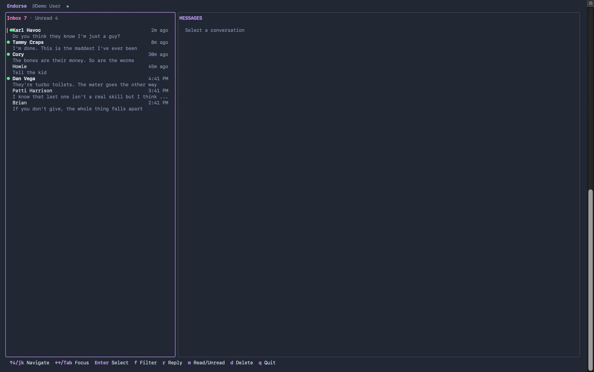

<p align="center">
  
</p>

# endorse

[](https://github.com/ggfevans/endorse/actions/workflows/ci.yml)
[](LICENSE)

It's LinkedIn messaging. In your terminal.

<!-- screenshot -->

## But Why

Primarily an experiment in learning Go and building terminal UIs with [Bubble Tea](https://github.com/charmbracelet/bubbletea). LinkedIn messaging was a convenient target — something I actually use, with enough complexity to be interesting.

## Why Only Messaging

LinkedIn used to have a perfectly good API. Then they closed it. Presumably so they could optimize engagement metrics, which is corporate for "we would like to show you more ads." What's left is messaging via [mautrix-linkedin](https://github.com/mautrix/linkedin), so that's what we've got. You can read your messages without seeing a single "Thoughts?" post. That's not nothing.

## Features

- Real-time messaging with live updates via SSE
- Keyboard-driven navigation
- Conversation list with unread filtering
- Threaded message view with grouped sender headers
- Dracula colour theme
- Compose and reply inline
- Mark read/unread, delete conversations
- Typing indicator

## Installation

```sh
go install github.com/ggfevans/endorse/cmd/endorse@latest
```

## Usage

Launch the TUI:

```sh
endorse
```

Try it without a LinkedIn account:

```sh
endorse --demo
```

On first launch you'll be prompted for your LinkedIn session cookies. Extract these from your browser's developer tools:

1. Open LinkedIn in your browser
2. Open Developer Tools (F12) → Application → Cookies
3. Copy the `li_at` cookie value
4. Paste it into the auth prompt

### Key Bindings

| Key | Action |
|-----|--------|
| `Tab` / `Shift+Tab` | Cycle focus between panels |
| `j` / `k` | Move down / up |
| `g` / `G` | Jump to top / bottom |
| `Enter` | Open conversation |
| `r` | Reply / compose |
| `m` | Toggle read/unread |
| `d` | Delete conversation |
| `Ctrl+D` | Send message |
| `Esc` | Back / cancel |
| `q` / `Ctrl+C` | Quit |

## Building from Source

```sh
git clone https://github.com/ggfevans/endorse.git
cd endorse
make build
```

The binary will be in `bin/endorse`.

### Running Tests

```sh
make test
```

## Built With Claude

This project was built using AI-assisted development with Claude. I told it what to build and it built the wrong thing and I said no and it built a different wrong thing and eventually we arrived here through a process best described as "collaborative stubbornness." Commits with substantial AI contributions are marked with `Co-authored-by` tags because we're not going to pretend otherwise.

## Contributing

See [CONTRIBUTING.md](CONTRIBUTING.md) for development setup and guidelines.

## License

[MIT](LICENSE) — provided as-is, no warranty

---

This project is not affiliated with, endorsed by, or even acknowledged by LinkedIn. LinkedIn does not know about this. If LinkedIn did know about this they would probably send a cease and desist, which is rich coming from a company that sends you 14 emails a week about people you went to junior high school with.
